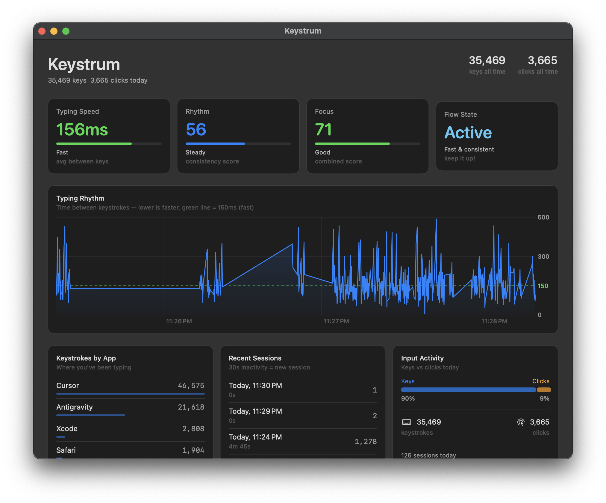
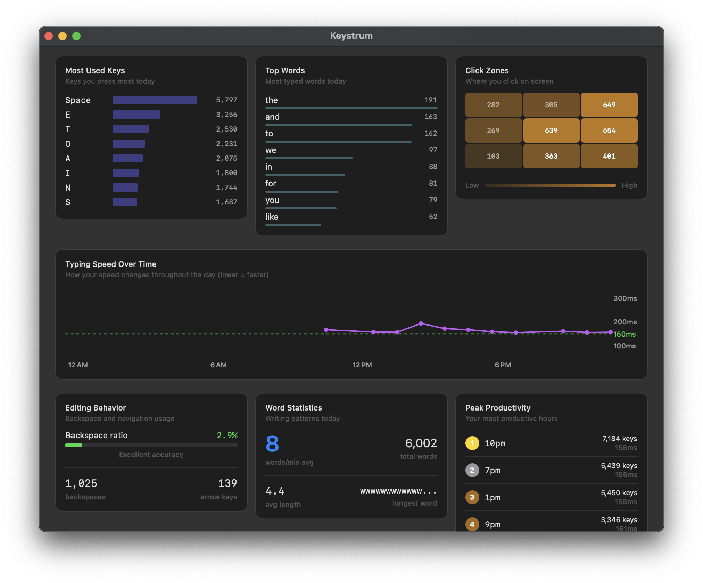

# Keystrum

An afternoon project: a macOS typing analytics dashboard that monitors your keyboard and mouse to show detailed insights into typing patterns, speed, and productivity.

## Features

- Real-time typing speed and rhythm analysis
- Flow state detection
- Activity tracking across apps
- Session analysis and productivity patterns
- SwiftUI dashboard with charts

Built with Opus 4.5
